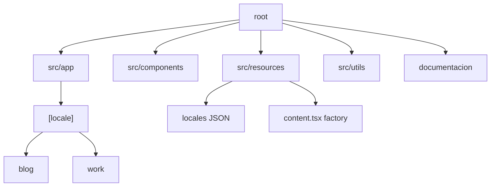

# Arquitectura del Proyecto

## Estructura de Carpetas

## Flujo de Datos i18n
1. El usuario accede a `/[locale]/ruta`.
2. `getDictionary(locale)` carga el JSON.
3. `getContent(dict)` inyecta los textos en los componentes Once UI.
4. Si es MDX, `getPosts(locale)` filtra por carpeta.

## Próximamente
- Diagramas de secuencia para procesos complejos.
- Mapa de componentes y dependencias.
